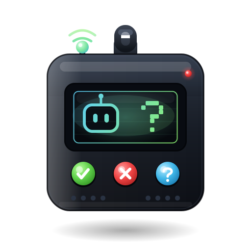

# ask-a-human

<p align="center">
  
</p>

<p align="center">
  <a href="https://www.npmjs.com/package/@askahuman/mcp"></a>
  <a href="LICENSE"></a>
  
  
  
</p>

<p align="center"><b>A private pager for your agent loops.</b></p>

<p align="center">
  <a href="https://ask-a-human.ai">Website</a> &nbsp;.&nbsp;
  <a href="https://ask-a-human.ai/app">Phone app</a> &nbsp;.&nbsp;
  <a href="https://www.npmjs.com/package/@askahuman/mcp">npm</a> &nbsp;.&nbsp;
  <a href="https://github.com/askahuman/askahuman">Repo</a> &nbsp;.&nbsp;
  <a href="https://ask-a-human.ai/llms.txt">For agents</a> &nbsp;.&nbsp;
  <a href="SECURITY.md">Security</a>
</p>

## Your agents run full-auto in loops. Until one needs you.

You run a hundred agents in loops, full permissions, mostly while you are asleep or away from the keyboard. They are not supposed to need you. Then, every so often, **one** of them hits the single step it should not take alone, and it has no way to reach you.

So reach back. `ask-a-human` lets that one agent tap you on the shoulder: it pings your phone and **blocks** until you answer, then unblocks and rolls on. Seconds, not minutes.

> For years, CAPTCHAs made humans prove they are not robots.
> Now you register **yourself** as a tool your agents call.

**100 agents. One human. One buzz at a time.**

<!-- HERO DEMO (the single biggest virality lever) goes here once recorded: a ~5s loop of
     terminal blocking on request_approval  ->  iPhone buzz + Yes/No card + tap  ->  terminal unblocks.
     Then drop in: <p align="center"></p> -->

## Setup in 30 seconds

Zero install. Zero account. Zero API key.

Paste this into your MCP client config (Cursor `~/.cursor/mcp.json`, Claude Desktop `claude_desktop_config.json`, Codex, or any MCP client), then restart the agent.

```json
{
  "mcpServers": {
    "ask-a-human": {
      "command": "npx",
      "args": ["-y", "@askahuman/mcp", "serve"]
    }
  }
}
```

That is it. Here is what happens:

- `npx` fetches one static release binary on first run.
- It defaults to the hosted relay `wss://ask-a-human.ai/ws` and the PWA at `https://ask-a-human.ai`.
- The first `request_approval` prints the pairing code to stderr **and** opens a local loopback browser page showing it. The code is never in a URL.
- Pin `https://ask-a-human.ai/app` to your iPhone home screen as a PWA, then type the code. (On iOS, Web Push only works once the app is installed to the home screen, and wake-ups are best-effort; when you open the app it shows a pending-count badge.)

Running your own relay? Point the agent at it with `--relay <wss-url>` (and `--public-relay <wss-url>` if your phone reaches the relay at a different address). See [self-hosting](#self-hosting).

## Works with your agents

<table>
  <tr>
    <td align="center" width="16%"><br /><sub>Claude Code</sub></td>
    <td align="center" width="16%"><br /><sub>Codex</sub></td>
    <td align="center" width="16%"><br /><sub>Cursor</sub></td>
    <td align="center" width="16%"><br /><sub>Copilot</sub></td>
    <td align="center" width="16%"><br /><sub>Gemini</sub></td>
    <td align="center" width="16%"><br /><sub><b>Any MCP client</b></sub></td>
  </tr>
</table>

If it speaks MCP, it can reach you. Same one-line config, zero extra setup.

## What lands on your phone

Four things, and that is the whole product. You pair once, then every `request_approval` blocks the agent until you answer.

<table>
  <tr>
    <td width="50%" valign="top">
      
      &nbsp;<b>New agent</b><br />
      <sub>1 &nbsp;&middot;&nbsp; PAIRING</sub>
      <br /><br />
      Open <code>ask-a-human.ai/app</code> on your phone and type the 8-character code it printed.
      <br /><br />
      <code>A B C D&nbsp; - &nbsp;2 3 4 5</code>
    </td>
    <td width="50%" valign="top">
      
      &nbsp;<b>Claude Code</b><br />
      <sub>2 &nbsp;&middot;&nbsp; YES / NO &nbsp;&middot;&nbsp; <code>response_kind: "yesno"</code></sub>
      <br /><br />
      All tests pass, but this release also runs a migration that drops <code>orders.coupon_code</code> on prod. Ship it?
      <br /><br />
      <code>&#10003; Approve</code> &nbsp; <code>&#10007; Decline</code>
    </td>
  </tr>
  <tr>
    <td valign="top">
      
      &nbsp;<b>Codex</b><br />
      <sub>3 &nbsp;&middot;&nbsp; MULTIPLE CHOICE &nbsp;&middot;&nbsp; <code>response_kind: "choice"</code></sub>
      <br /><br />
      <code>main</code> has been red for 20 min and 3 deploys are stuck behind it. How do I unblock it?
      <br /><br />
      <code>Revert it</code> &nbsp; <code>Hotfix forward</code> &nbsp; <code>Hold, I'll look</code>
    </td>
    <td valign="top">
      
      &nbsp;<b>Cursor</b><br />
      <sub>4 &nbsp;&middot;&nbsp; FREE-FORM REPLY &nbsp;&middot;&nbsp; <code>response_kind: "text"</code></sub>
      <br /><br />
      A customer is escalating in the support thread and demanding a refund I'm not allowed to approve. How should I reply?
      <br /><br />
      <i>Type your reply&hellip;</i>
    </td>
  </tr>
</table>

**It NEVER auto-approves.** A decline, a timeout, or an error is never returned as approved. Silence is not a yes.

## One phone. Every agent.

This is how a hundred agents become one buzz at a time. Pair each agent once and it gets its own chip in a roster strip, labeled by `--name` (say `cursor @ workstation` or `nightly-deploy-bot`) so you always know who is asking. When an agent needs you, its chip lights up with a pulsing red dot and jumps to the front of the strip. Tap it, answer, move on. Pair as many as you want.

## The flow

```
1. Agent hits a wall it should not pass alone
2. The request is sealed in a wormhole
3. Your phone buzzes
4. You tap: approve, decline, or reply
5. The agent unblocks and rolls on
```

Seconds, not minutes.

## Why we built this

We built this for ourselves first. The hard part of running agents in bulk was never the work, it was the rare moment one of them needed a judgment call and we weren't at the keyboard.

We didn't want a dashboard, an account, or another company holding our messages. So it's private by design: everything travels through a magic wormhole, end-to-end encrypted, and the relay in the middle is blind. We don't track anything, there's no database, and we pay for the hosting ourselves.

No data to sell, no funnel, no catch. We built it because we needed it, and our only goal is for it to spread.

---

## How it works

The MCP server runs **locally** on your machine, on purpose. It is the only party holding the key and the plaintext, so it is never hosted. Only the content-blind relay lives on a server, and it is a dumb pipe.

```
  AGENT SIDE                    RELAY (content-blind)          YOUR PHONE
 +--------------+   seal      +------------------+   blob   +----------------+
 | MCP agent    | ----------> | rooms-of-two WS  | -------> | phone PWA      |
 | request_     |             | verbatim forward |          | swipe / choose |
 |   approval   | <---------- | RAM-only, no DB  | <------- | / reply -> seal|
 +--------------+   open      +------------------+   blob   +----------------+
        the relay sees only ciphertext + which room-id talks to which
```

## The MCP tools

Three tools. No surprises.

### `request_approval`

Ask a human. **BLOCKS** until they respond. Pass `expires_in_s` to also time out after N seconds; omit it and the call waits indefinitely (until answered, or the connection drops).

| Field | Type | Required | Notes |
|---|---|---|---|
| `title` | string | yes | Short card title. |
| `summary` | string | yes | The question body. |
| `response_kind` | string | yes | `"yesno"` \| `"choice"` \| `"text"`. |
| `category` | string | no | Badge. Recognized: `cash` \| `deploy` \| `data` \| `access` \| `other`. Any other value is still shown, just with the neutral `other` color. |
| `options` | string[] | no | Choices when `response_kind` is `"choice"`. |
| `placeholder` | string | no | Input hint when `"text"`. |
| `max_len` | integer | no | Max input length when `"text"`. |
| `expires_in_s` | integer | no | Countdown seconds before timeout. Omit it and the request never times out on its own. |

**Returns** the shape you asked for: `yesno` gives an `approved` boolean, `choice` gives the selected option, `text` gives the typed reply. A decline comes back as a non-approval; a timeout or transport error is returned as an error the agent can branch on. It never silently proceeds, and never returns approved on failure.

### `pair_status`

Read-only. Reports whether the agent is paired, waiting to pair, or idle (as a short status message). Never returns the code. Does not start pairing (use `start_pairing` for that).

### `start_pairing`

Read-only trigger. Begins pairing with your phone eagerly, instead of waiting for the first `request_approval`. Prints the short code in the agent terminal for you to type into the app; the handshake runs in the background and the tool returns immediately. Returns only non-secret status. The code never appears in the result.

For agents: [`https://ask-a-human.ai/llms.txt`](https://ask-a-human.ai/llms.txt)

## How the crypto works

This is the whole point, so it is built to be boring and verifiable.

- **End-to-end encrypted.** Plaintext only ever exists on your machine and on your phone.
- **Content-blind relay.** It only ever forwards `base64(nonce‖ciphertext)` plus which room talks to which. It cannot read, log, or forge a decision (replay is blocked separately, by per-request IDs the phone de-dupes on). It is a dumb pipe.
- **No accounts, no database.** Pairing lives in RAM for the server's lifetime. Restart = re-pair. There is nothing on the relay to breach: no accounts, no database, content-blind. (The real attack surface is your phone's PWA and the pairing channel. See [`SECURITY.md`](SECURITY.md).)
- **Pairing is a SPAKE2-style PAKE.** A short code becomes a strong shared key. Even if the code is shoulder-surfed, an attacker gets exactly **one** online guess against the live handshake.
- **App traffic is sealed with NaCl secretbox** (XSalsa20-Poly1305), keyed by the symmetric SPAKE2 session key.

The PAKE is an in-house construction following [RFC 9382](https://www.rfc-editor.org/rfc/rfc9382) over the ristretto255 group ([RFC 9496](https://www.rfc-editor.org/rfc/rfc9496)), Magic-Wormhole-inspired. Go uses [`gtank/ristretto255`](https://github.com/gtank/ristretto255), the PWA uses [`@noble/curves`](https://github.com/paulmillr/noble-curves), and Go to JS interop is pinned by `frontend/test/spake2-interop.mjs`. The short code is the PAKE password: it never reaches the model and never travels in a URL.

Read every line. See [`SECURITY.md`](SECURITY.md) and the ADRs in [`docs/decisions/architecture/`](docs/decisions/architecture/) (start with [`0002_spake2_ristretto255_secretbox.md`](docs/decisions/architecture/0002_spake2_ristretto255_secretbox.md) for the crypto and [`0011_npx_distribution_stdio_local_mcp.md`](docs/decisions/architecture/0011_npx_distribution_stdio_local_mcp.md) for npx/stdio).

## Self-hosting

The server is already local. To point at your own relay, pass `--relay`:

```bash
npx -y @askahuman/mcp serve --relay <wss-url>
```

If your phone dials the relay at a different URL than the agent does, add `--public-relay`:

```bash
npx -y @askahuman/mcp serve --relay <wss-url> --public-relay <wss-url>
```

Or in your MCP client config:

```json
{
  "mcpServers": {
    "ask-a-human": {
      "command": "npx",
      "args": ["-y", "@askahuman/mcp", "serve", "--relay", "wss://your-relay/ws"]
    }
  }
}
```

The `serve` flags are `--relay <wss-url>` (the relay the agent dials), `--public-relay <wss-url>` (the relay the phone dials, when it differs from `--relay`), and `--name <text>` (who is asking, shown on the card). The MCP server still runs locally (it has to: it holds the key and the plaintext). Only the content-blind relay and the static PWA move to your infra. Both are in this repo, MIT-licensed, with deploy manifests under `infra/`.

**Mirroring the binary.** The postinstall verifies the downloaded binary's sha256 before installing it, so a custom `AAH_BINARY_BASEURL` mirror must serve `checksums.txt` over **https** alongside the archives, **or** you must pin the digest out of band with `AAH_BINARY_SHA256=<sha256>`. Plain `http://` mirrors are rejected. To place the binary yourself, set `AAH_SKIP_DOWNLOAD=1` and drop it in `node_modules/@askahuman/mcp/bin/`.

## Repo layout

| Path | What's inside |
|---|---|
| `backend/` | Go relay (`cmd/relay`) + MCP agent (`cmd/agent`); `pkg/spake2`, `pkg/sealedbox`, `pkg/wire`. |
| `frontend/` | Astro 5 + React 19 + Tailwind 4 static PWA (the app and the landing); client-side crypto. |
| `npm/` | `@askahuman/mcp` wrapper: postinstall pulls the matching release binary; `bin/cli.js` execs it. |
| `infra/` | ctlptl/kind cluster, ko/Tilt build, kustomize base/local/prod (GKE). |
| `docs/` | `plan.md` + `decisions/` (ADRs). Read these first. |

## Dev and tests

Local dev runs on Tilt + kind (`make up` / `make ci-up`).

| What | Command |
|---|---|
| Backend unit tests | `make backend-test` (`go test ./...`) |
| Backend integration | `go test -tags integration ./...` (in `backend/`) |
| Frontend unit tests | `bun run test` (in `frontend/`) |
| SPAKE2 interop | `node test/spake2-interop.mjs` (in `frontend/`) |
| End-to-end | `make ci-up && make e2e` (live agent + relay-in-kind + real PWA in headless Chromium) |

More depth lives in [`docs/`](docs/) (start with `plan.md` and the ADRs).

## Links

- Repo: https://github.com/askahuman/askahuman
- Website: https://ask-a-human.ai
- App (phone PWA): https://ask-a-human.ai/app
- npm: https://www.npmjs.com/package/@askahuman/mcp
- For agents: https://ask-a-human.ai/llms.txt

## Security and license

- Found something? See [`SECURITY.md`](SECURITY.md).
- Licensed under [MIT](LICENSE). Read every line, run your own, make it yours.

<p align="center">
  
</p>

<p align="center"><b>100 agents. One human. One buzz at a time.</b></p>

<p align="center">
  <a href="https://ask-a-human.ai">ask-a-human.ai</a>
</p>
